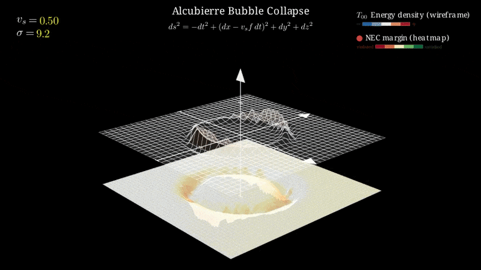

# warpax

[](https://doi.org/10.5281/zenodo.18715933)
[](https://github.com/anindex/warpax/actions/workflows/ci.yml)
[](https://python.org)
[](LICENSE)

**Observer-robust energy condition verification for warp drive spacetimes.**

warpax uses JAX automatic differentiation to compute exact curvature tensors from
analytic warp drive metrics and performs continuous BFGS optimization over the full
timelike observer manifold to find worst-case energy condition violations. This goes
beyond the standard Eulerian-observer approach (as in WarpFactory) by searching over
all physically admissible observers, parameterized by bounded rapidity in stereographic
coordinates, to detect violations that axis-aligned sampling can miss.



<p align="center"><em>Geodesic paths through a collapsing Alcubierre warp bubble, computed via WarpAX's autodiff curvature pipeline.</em></p>

## Quick start

```bash
conda create -n warpax python=3.12 -y
conda activate warpax
pip install -e ".[dev]"
```

## Examples

| Script | Description |
|--------|-------------|
| `examples/01_minkowski_sanity.py` | Flat-space sanity check (all ECs satisfied) |
| `examples/02_schwarzschild_verification.py` | Schwarzschild ground-truth validation |
| `examples/03_alcubierre_analysis.py` | Alcubierre warp drive EC analysis |
| `examples/04_warp_drive_comparison.py` | Multi-metric comparison (6 warp drives) |
| `examples/05_grid_analysis.py` | Grid-based EC verification |
| `examples/06_geodesic_through_warp_bubble.py` | Geodesic integration with tidal forces and blueshift |

Run any example:

```bash
python examples/01_minkowski_sanity.py
```

## Reproducing results

The full reproduction pipeline regenerates all cached results and figures:

```bash
bash reproduce_all.sh
```

Phases can be run individually:

```bash
bash reproduce_all.sh --phase 1   # Core computation
bash reproduce_all.sh --phase 2   # Ablation studies
bash reproduce_all.sh --phase 3   # Figure generation
```

Use `--keep-cache` to skip cache deletion and only recompute missing results.

## Running tests

```bash
pytest                  # ~450 tests
pytest -m "not slow"    # Skip expensive grid tests
```

## Manim visualizations

Animated 3D visualizations of warp bubble dynamics require the optional `manim`
dependencies and system packages:

```bash
# System dependencies (Ubuntu/Debian)
sudo apt install texlive-latex-extra texlive-fonts-recommended dvipng cm-super ffmpeg

# Python dependencies
pip install -e ".[manim]"

# Render all scenes
python scripts/render_all_scenes.py

# Or render individual scenes
bash scripts/render_manim_scenes.sh
```

Rendered videos and images are written to `media/` (not tracked by git).

## Architecture

warpax is organized into six sub-packages:

| Package | Description |
|---------|-------------|
| `geometry` | JAX autodiff pipeline: metric -> Christoffel -> Riemann -> Ricci -> Einstein -> $T_{\mu\nu}$ |
| `energy_conditions` | NEC/WEC/SEC/DEC verification via Hawking–Ellis classification, eigenvalue algebra, and BFGS observer optimization |
| `metrics` | Six warp drive metric implementations: Alcubierre, Natário, Lentz, Rodal, Van den Broeck, WarpShell |
| `geodesics` | Timelike/null geodesic integration via Diffrax, tidal deviation, blueshift extraction |
| `analysis` | Eulerian vs robust comparison, Richardson convergence, kinematic scalars |
| `visualization` | Matplotlib publication figures and Manim animated scenes |

All metrics implement a common `MetricFunction` interface: a callable `(4,) -> (4,4)` mapping
coordinates $x^\mu$ to the covariant metric tensor $g_{\mu\nu}$. This enables a uniform
autodiff-based curvature pipeline across all spacetimes.
