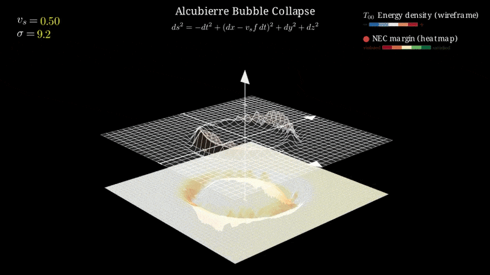
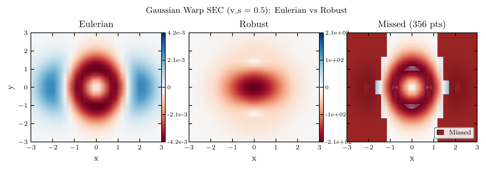

# warpax

[](https://arxiv.org/abs/2602.18023)
[](https://doi.org/10.5281/zenodo.18715933)
[](https://github.com/anindex/warpax/actions/workflows/ci.yml)
[](https://python.org)
[](LICENSE)

[**Observer-robust energy condition verification for warp drive spacetimes.**](https://arxiv.org/abs/2602.18023)

warpax uses JAX automatic differentiation to compute exact curvature tensors from
analytic warp drive metrics and performs continuous BFGS optimization over the full
timelike observer manifold to find worst-case energy condition violations. This goes
beyond the standard Eulerian-observer approach (as in WarpFactory) by searching over
all physically admissible observers, parameterized by bounded rapidity in stereographic
coordinates, to detect violations that axis-aligned sampling can miss.



<p align="center"><em>Geodesic paths through a collapsing Alcubierre warp bubble, computed via WarpAX's autodiff curvature pipeline.</em></p>

## Quick start

```bash
conda create -n warpax python=3.12 -y
conda activate warpax
pip install -e ".[dev]"
```

For a 5-10 minute walkthrough from install to seeing an energy condition violation,
see the [Quickstart tutorial](docs/tutorials/quickstart.md).

## What's new in v0.2.0

This release addresses the CQG-115130 major-revision reviewer report with three groups
of additions (full changelog in [`CHANGELOG.md`](CHANGELOG.md)):

1. **Observer-optimization performance** - an optional fp32 pre-screen with fp64
   verification band, spatial-neighbor warm-start for grid evaluation, and a
   Fibonacci+BFGS top-k starter pool.
2. **Community I/O and infrastructure** - WarpFactory, EinFields, and Cactus metric
   loaders, an asv benchmark harness, Manim-based animated visualizations, and an
   MkDocs documentation site.
3. **Shape-function design** - a differentiable shape-function parametrization
   (B-spline / Bernstein / Gaussian-mixture bases) with a constrained
   projected-gradient BFGS optimizer.

### Custom metric design with robust EC validation

Users can define their own warp manifold by subclassing `ADMMetric` and run the
full verification pipeline. Below, a Gaussian warp bubble is validated on a 24x24x4
grid. The three panels compare SEC margins seen by the Eulerian observer (left) vs
the worst-case boosted observer found by BFGS (center). The right panel highlights
356 grid points where the Eulerian frame incorrectly reports SEC as satisfied -
violations only visible to non-Eulerian observers.



<p align="center"><em>SEC comparison for a custom Gaussian warp bubble (v<sub>s</sub> = 0.5). Red regions are violations missed by Eulerian-only analysis.</em></p>

See [`examples/07_custom_warp_metric.py`](examples/07_custom_warp_metric.py) for the full worked example.

## Examples

| Script | Description |
|--------|-------------|
| `examples/01_minkowski_sanity.py` | Flat-space sanity check (all ECs satisfied) |
| `examples/02_schwarzschild_verification.py` | Schwarzschild ground-truth validation |
| `examples/03_alcubierre_analysis.py` | Alcubierre warp drive EC analysis |
| `examples/04_warp_drive_comparison.py` | Multi-metric comparison (6 warp drives) |
| `examples/05_grid_analysis.py` | Grid-based EC verification |
| `examples/06_geodesic_through_warp_bubble.py` | Geodesic integration with tidal forces and blueshift |
| `examples/07_custom_warp_metric.py` | Custom warp manifold design with robust EC validation |
| `examples/08_metric_design.py` | Shape-function metric design with constrained optimization |

Run any example:

```bash
python examples/01_minkowski_sanity.py
```

## Reproducing results

To pin the exact Python environment used for the CQG revision:

```bash
export PYTHON=$(uv run which python)
bash reproduce_all.sh
```

Phases can be run individually:

```bash
bash reproduce_all.sh --phase 1   # Core computation
bash reproduce_all.sh --phase 2   # Ablation studies
bash reproduce_all.sh --phase 3   # Figure generation
bash reproduce_all.sh --phase 4   # Paper build (pdflatex)
```

Use `--keep-cache` to skip cache deletion and only recompute missing results.

## Running tests

```bash
pytest                   # Full suite (~780 tests)
pytest -m "not slow"     # Skip expensive grid tests
```

## Documentation

warpax ships comprehensive documentation in [`docs/`](docs/), organized following the
[Diataxis](https://diataxis.fr/) framework:

### Tutorials

- [**Quickstart**](docs/tutorials/quickstart.md) - 5-10 minutes from install to seeing an energy condition violation
- [**First curvature computation**](docs/tutorials/first_curvature_computation.md) - full curvature chain on Minkowski as a warm-up

### How-to guides

- [**Define a custom warp metric**](docs/how-to/custom_metric_tutorial.md) - subclass `ADMMetric` and run the verification pipeline
- [**Interpret EC results**](docs/how-to/interpreting_ec_results.md) - read margin signs, Hawking-Ellis types, and worst-case observers
- [**Load an external metric**](docs/how-to/loading_external_metrics.md) - use WarpFactory, EinFields, or Cactus data

### Reference

- [**API reference**](docs/reference/index.md) - autodoc of the public API
- [**Metric catalog**](docs/reference/metric_catalog.md) - all eight shipped metrics
- [**Pinned API defaults**](docs/reference/api_defaults.md) - frozen v0.1.x default parameters
- [**Benchmarks**](docs/reference/benchmarks.md) - asv regression harness

### Explanation

- [**Architecture**](docs/explanation/ARCHITECTURE.md) - package structure and design decisions
- [**Theory: ADM 3+1 and Hawking-Ellis types**](docs/explanation/theory.md) - mathematical background
- [**Release notes**](docs/explanation/release_notes.md) - changelog with narrative context

## Architecture

warpax is organized into the following sub-packages:

| Package | Description |
|---------|-------------|
| `geometry` | JAX autodiff pipeline: metric -> Christoffel -> Riemann -> Ricci -> Einstein -> $T_{\mu\nu}$ |
| `energy_conditions` | NEC/WEC/SEC/DEC verification via Hawking-Ellis classification, eigenvalue algebra, and BFGS observer optimization |
| `metrics` | Six warp drive metrics: Alcubierre, Natario, Lentz, Rodal, Van den Broeck, WarpShell |
| `geodesics` | Timelike/null geodesic integration via Diffrax, tidal deviation, blueshift extraction |
| `analysis` | Eulerian vs robust comparison, Richardson convergence, kinematic scalars |
| `design` | Differentiable shape-function parametrization with constrained optimizer |
| `io` | External metric loaders: WarpFactory (.mat), EinFields (checkpoint), Cactus (HDF5) |
| `grids` | Wall-clustered and two-level AMR grid families |
| `classify` | Bobrick-Martire subluminal/superluminal classifier |
| `averaged` | ANEC/AWEC line integrals along geodesics |
| `quantum` | Ford-Roman quantum inequality evaluator |
| `junction` | Darmois junction conditions at bubble wall |
| `visualization` | Matplotlib publication figures and Manim animated scenes |

All metrics implement a common `MetricFunction` interface: a callable `(4,) -> (4,4)` mapping
coordinates $x^\mu$ to the covariant metric tensor $g_{\mu\nu}$. This enables a uniform
autodiff-based curvature pipeline across all spacetimes.

## Manim visualizations

Animated 3D visualizations of warp bubble dynamics require the optional `manim`
dependencies:

```bash
# System dependencies (Ubuntu/Debian)
sudo apt install texlive-latex-extra texlive-fonts-recommended dvipng cm-super ffmpeg

# Python dependencies
pip install -e ".[manim]"

# Render all scenes
python scripts/render_all_scenes.py
```

Rendered videos and images are written to `media/` (not tracked by git).

## Citation

If you found this work useful, please consider citing:

```bibtex
@article{le2026warpax,
    title   = {Observer-robust energy condition verification for warp drive spacetimes},
    author  = {An T. Le},
    year    = {2026},
    eprint  = {arXiv:2602.18023},
    doi     = {10.5281/zenodo.18715933}
}
```
